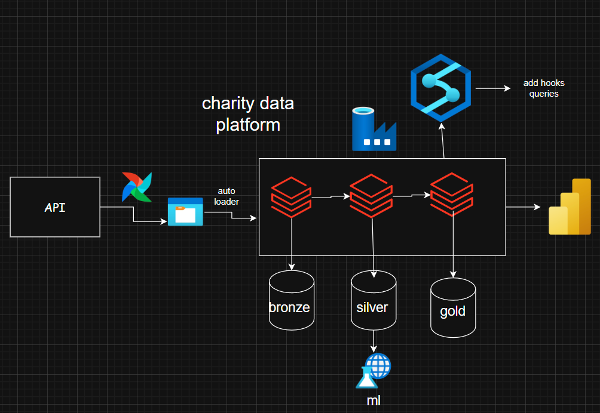
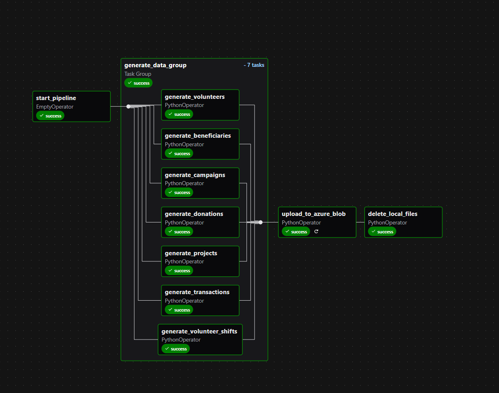
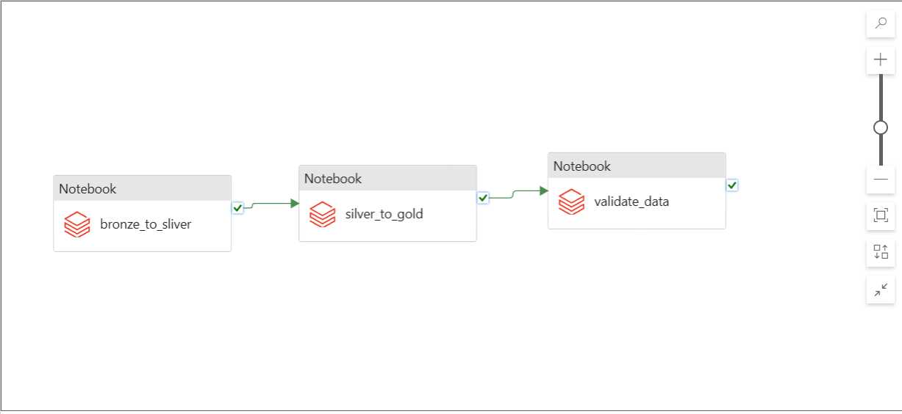
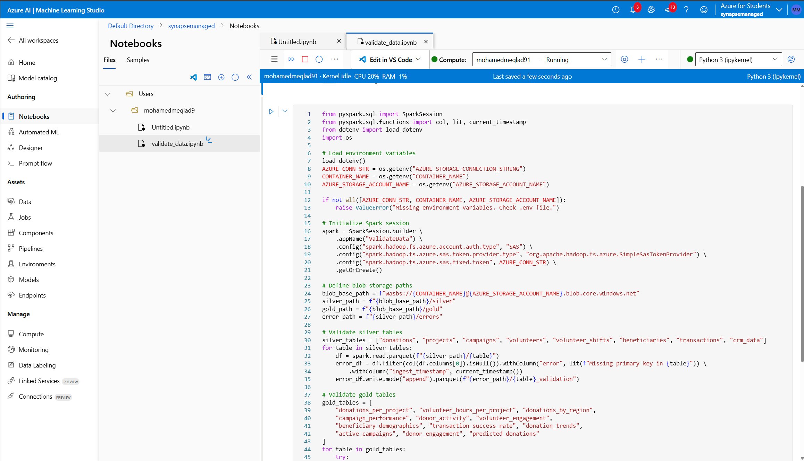
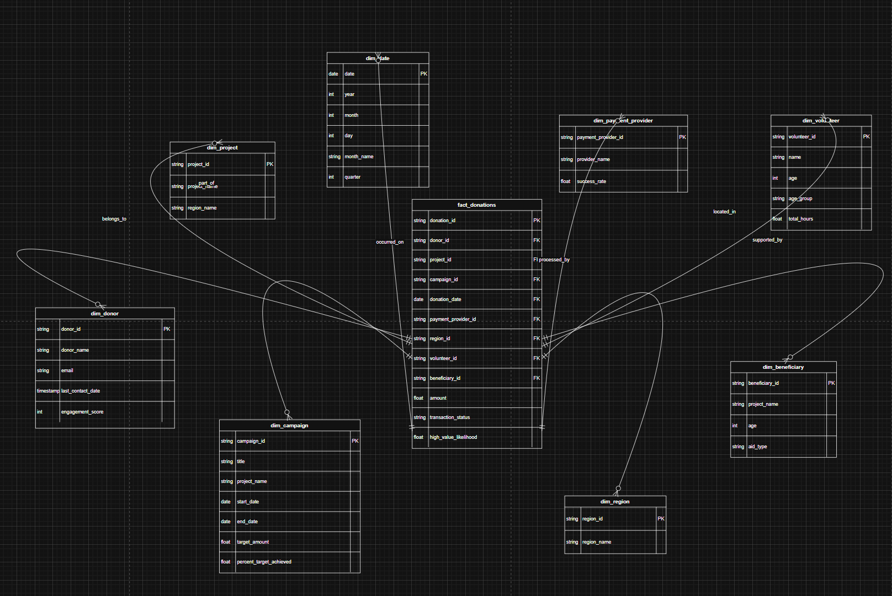
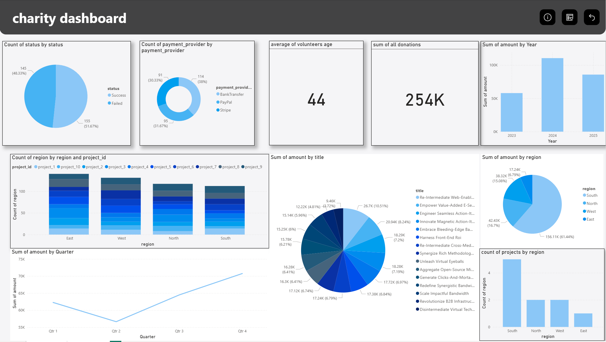
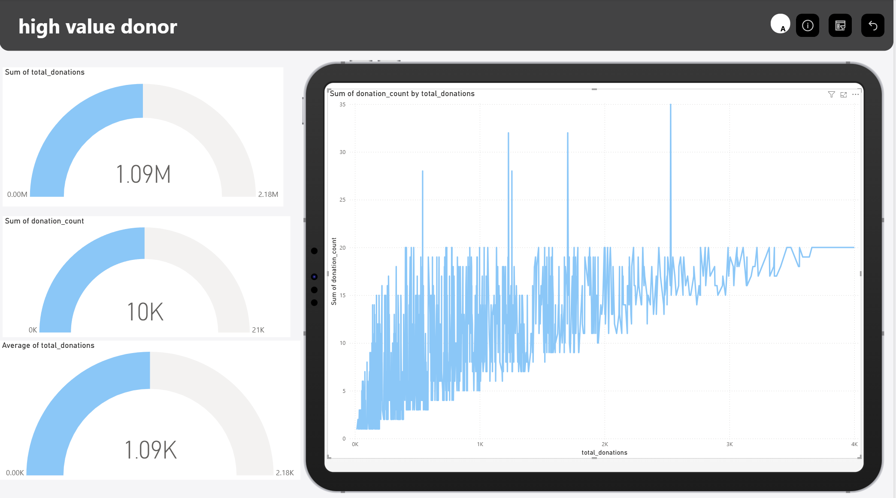

# Charity Data Pipeline

The **Charity Data Pipeline** is a modern, cloud-based data processing and analytics solution built on **Microsoft Azure**. It is designed to manage, process, analyze, and visualize charity-related data, including donations, projects, campaigns, volunteers, and beneficiaries.

> This project supports actionable insights, optimized campaign strategies, and enhanced donor engagement using a secure and scalable architecture.

---

## 🚀 Overview

This end-to-end data pipeline handles:

- **Data Ingestion** from CSV/JSON files
- **Data Transformation** and cleaning with Apache Spark
- **Star Schema Modeling** for analytics
- **Machine Learning** for donor prediction
- **Interactive Dashboards** for reporting
- **Workflow Orchestration**: initially using **Apache Airflow**, then migrated to **Azure Data Factory** for cloud-native integration

---

## 🏗️ Architecture

The pipeline follows a **layered architecture** based on the medallion design pattern:

### 1. **Bronze Layer – Raw Ingestion**
- **Source**: External CSV/JSON files
- **Landing Zone**: Azure Blob Storage
- **Catalog**: `charity_catalog.bronze`
- **Goal**: Store raw, unprocessed data

### 2. **Silver Layer – Cleaned and Validated Data**
- **Processes**: Null handling, deduplication, schema enforcement
- **Format**: Parquet
- **Catalog**: `charity_catalog.silver`
- **Goal**: Queryable and validated intermediate data

### 3. **Gold Layer – Analytics Ready**
- **Structure**: Star schema (Fact + Dimension tables)
- **Catalog**: `charity_catalog.gold`
- **Query Engine**: Azure Synapse SQL Pool
- **Goal**: Business intelligence and advanced analytics

---

## 🧰 Tools & Technologies

| Tool/Service              | Purpose                                                             |
|---------------------------|----------------------------------------------------------------------|
| **Apache Airflow**        | Early-stage pipeline orchestration                                  |
| **Azure Data Factory**    | Final orchestration and scheduling                                  |
| **Azure Databricks**      | Data transformation with Spark & Python                             |
| **Unity Catalog**         | Centralized governance and metadata                                 |
| **Azure Machine Learning**| Donor prediction modeling                                           |
| **Azure Synapse Analytics**| Star schema hosting and querying                                  |
| **Power BI**              | Visualization of campaign, donation, and volunteer insights         |

---

## 🧪 Machine Learning
The ML module uses Azure Machine Learning to predict high-value donors based on historical behavior.
- Target Output: **high_value_donors**
- Input Features:
**Donation frequency**
**Campaign engagement**
**Donor demographics**

## 🧩 Data Modeling & Azure Synapse Analytics

To enable fast, flexible, and business-friendly reporting, the project uses a **star schema** modeled and hosted in **Azure Synapse Analytics**. This schema simplifies querying for Power BI dashboards and machine learning insights.

### 📐 Star Schema Design

This design allows slicing and dicing of donation data across campaigns, time, and geography, improving usability in BI tools.

## 📊 Power BI Dashboards

**Power BI** is the primary visualization tool used to turn processed charity data into interactive and insightful dashboards. These dashboards empower stakeholders to track donations, evaluate campaign performance, and understand volunteer and beneficiary impact—all in real time.

---

### 🎯 Key Dashboards & Reports

The following dashboards are built on top of the **gold layer** (star schema) hosted in **Azure Synapse Analytics**:

- **Donation Trends Dashboard**
  - Monthly and yearly donation summaries
  - Donation distribution by campaign, donor region, and donor type

- **Campaign Performance Dashboard**
  - Total donations per campaign
  - Engagement rate vs. donation value
  
- **Donor Segmentation Dashboard**
  - Predicted high-value donors (from Azure ML)
  - Churn risk indicators
  - Donor acquisition and retention metrics

- **Volunteer and Project Insights**
  - Volunteer participation by project and region
  - Beneficiary impact summaries
  - Resource allocation effectiveness

---

## ✅ Final Thoughts

This end-to-end **Charity Data Pipeline** showcases how modern data engineering tools and practices can transform raw data into **actionable insights** for a real-world mission. By integrating **Azure**, **Apache Airflow**, **Azure Data Factory**, **Azure Synapse Analytics**, **Power BI**, and **Azure Machine Learning**, we built a robust and scalable platform that empowers non-profit decision-makers.

---

### 📌 Key Accomplishments

- 🚀 **Automated Data Pipelines** using Apache Airflow and Azure Data Factory  
- 🧹 **Efficient Data Cleaning & Transformation** using PySpark and Synapse pipelines  
- 🧠 **Machine Learning Integration** to predict high-value donors and churn risk  
- 🗃️ **Data Modeling with Star Schema** for optimized querying and reporting  
- 📊 **Interactive Dashboards in Power BI** for real-time insights  
- 🔐 **End-to-End Security** with managed identities and role-based access

---

### 🔮 Future Enhancements

- Integrate **real-time streaming** with Azure Event Hubs or Kafka
- Add **alerting systems** (e.g., for fraud detection or donation spikes)
- Introduce **multilingual dashboard support** for international campaigns
- Expand ML models to **recommend donation amounts** or **campaign optimizations**
- Enable **mobile dashboard access** for field workers and campaign managers

